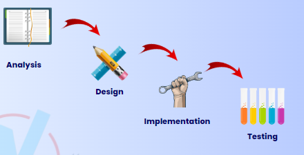
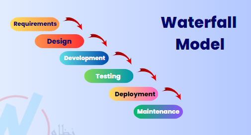
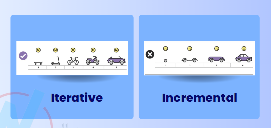
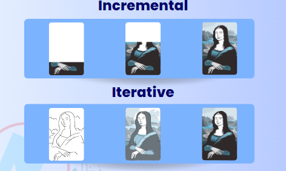
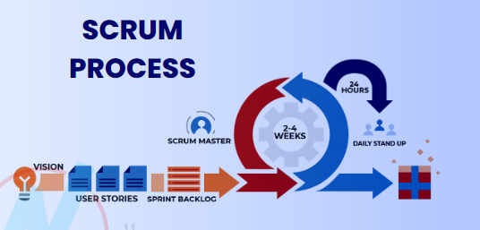
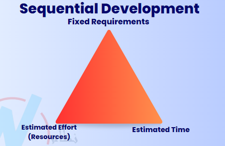
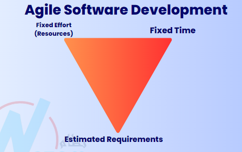
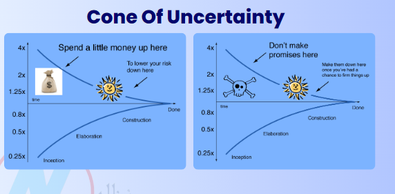

# [The Complete 2025 Software Testing Bootcamp](https://www.udemy.com/course/testerbootcamp/)

## Roles in the Software Development Team

- **Requirements engineers** :
  - The person who collects the requirements from the client and documents them.
  - Mostly a product owner or business analyst.
  - The link between the client and the IT team.
  - Business Analyst mostly responsible of writing more than one document, one of them is Software Requirements Specification (SRS).
  - Product owner is mostly part of Agile team.
  - Product owner writes product backlog, user story (a short of decription of a feature from the end-user perspective) to satisfy customer requirements.
- **UI/UX**:
  - **UI**: Create the visual design of the application (wireframes, mockups, etc.).
  - **UX**: Focus on the user experience, ensuring the application is user-friendly and meets user needs.
- **Front-End, Back-End, and Mobile developers**:
  - **Front-end developers**: Work on the client side of the application, creating the user interface and user experience.
  - **Back-End developers**: Work on the server side, handling the logic, database interactions, and server configuration.
  - **Mobile developers**: Specialize in creating applications for mobile devices, either native or cross-platform.
- **Project Manager & Scrum Master**:
  - **Project Manager**: Manage the project, ensuring it stays on track, within budget, and meets deadlines.
  - **Scrum Master**: Facilitate the Scrum process in Agile teams, ensuring that the team follows Agile principles and practices.
- **Other roles**:
  - **Data scientist**
  - **Database administrator**
  - **AI Specialist**
  - **DevOps Engineer**
  - **Ethical Hacker**
  - **Cloud Engineer**

## How Software is Developed (Software Development Lifecycle (SDLC) Models)

### 1. Sequential Development



- It's called sequential because each phase must be completed before the next one begins.
- Analysis -> Product owner
- Design -> UI/UX
- Implementation -> Developers
- Testing -> Testers

Example of sequential development:

- **Waterfall Model**:  
  
  - A traditional SDLC model.
  - A linear and sequential approach to software development.
  - Each phase must be completed before moving to the next.
  - Advantages:
    - Simple and easy to understand.
    - Well-structured and disciplined.
  - Disadvantages:
    - Inflexible to changes.
    - Difficult to accommodate changes once a phase is completed.
    - Not suitable for projects with evolving requirements.
- **V-Model**:  
  

  - Create to overcome the limitations of the Waterfall model.
  - Each development phase is associate with a corresponding testing phase.
  - **Requirements**: what the system should do (BRD) | **Acceptance Testing**
  - **Specification**: how the system going to developed (SRS) | **System Testing**
  - **Architectural Design**: how the system going to be designed, interaction between the system component (HLD) | **Integration Testing**
  - **Detailed Design**: detailed design of each component (LLD) | **Unit Testing**
  - **Coding**: actual coding of the system

  - Advantages:
    - Early detection of defects.
    - Each phase has a corresponding testing phase.
    - Better suited for projects with well-defined requirements.
  - Diadvantages:
    - Still inflexible to changes.
    - Not suitable for projects with evolving requirements.
    - Requires extensive documentation.

### 2. Agile Development

- Customer does not give feedback at the end of the project, but during the development process.

Example of Agile development:

- **Iterative**:

  - Focuses on repeating and refining the system or feature.
  - Start with a basic version and improve it over time.
  - Adding more features with each iteration.
  - Analogy: like drawing a potrait, where you start with a rough sketch and refine it with each iteration.
  - Example:
    - Iteration 1: Build a simple login page.
    - Iteration 2: Add input validation.
    - Iteration 3: Add "Remember Me" functionality.
    - Iteration 4: Add Google Login.

- **Incremental**:
  - Focuses on building and delivering features piece by piece.
  - Build the product in small, complete chunks (increments).
  - Each increment adds new functionality to the existing system.
  - The product becomes more complete with each increment.
  - Analogy: like building a house, where you start with the foundation and add rooms one by one.
  - Example:
    - Increment 1: Build the login feature.
    - Increment 2: Add the registration feature.
    - Increment 3: Add the profile management feature.
    - Increment 4: Add the dashboard feature.




### Scrum Process



- **Scrum**: A framework for Agile development.
- **User stories**: A short description of a feature from the end-user perspective, written by the product owner.
- **Product backlog**: A priotitized list of features, enhancements, and bug fixes.
- **Sprint backlog**: A list of tasks to be completed in a sprint, derived from the product backlog.
- **Sprint**: A time-boxed period (usually 2-4 weeks) during which a set of tasks is completed.
- **Daily standup**: A short meeting (15 minutes) where team members share what they did yesterday, what tehy will do today, and any blockers they are facing.
- **Sprint review**: A meeting at the end of the sprint to demonstrate the completed work and gather feedback.

### Diference between Agile and Sequential Development

- Agile is more flexible and adaptable to changes, while sequential development is more rigid and structured.
- Sequential: Fixed requirements - Estiated time - Estimate resources
- Agile: Fixed time - Fixed resources - Estimated requirements




- Cone of Uncertainty:
  - A concept that illustrates how uncertainty decreases as a project progresses.
  - At the beginning of a project, there is a high level of uncertainty about requirements, design, and implementation.
  - As the project progresses, more information is gathered, and uncertainty decreases.



## Basic Concepts of Software Testing

### What is Testing?

- **Software testing** is a way to:
  - asses the quality of the software.
  - reduce the risk of software failure in operation.
- The process of evaluating a system or its components to determine whether they satisfy specified requirements and to identify any defects.
- Most people have had an experience with software that didnt work as expected.
- Software that does not work correctly can lead to many problems, including:
  - Loss of money, time, or business reputation.
  - Injury or death
- Software testing is not only Test execution.
- Software testing is a process which includes many different activites.
- Execution is only one of these activites.

### Main types of Testing

1. Dynamic Testing
   - Dynamic testing requires type of processing the software.
   - The code must be run to perform dynamic testing.
   - Compare the actual results with the expected results.
2. Static Testing
   - Static testing does not require running the code.
   - It is done by reviewing the design, code, and documentation.
   - It is done to find defects before the code is executed.

### Validation vs Verification

**Validation**

- Ensures the software meets the needs and expectations of the end-users.
- Focuses on whether the right product is being built.
- Answers the question: "Are we building the right product?"

**Verification**

- Ensures the software meets the specified requirements and standards.
- Focuses on whether the product is built correctly.
- Answers the question: "Are we building the product right?"

| Validation                     | Verification             |
| ------------------------------ | ------------------------ |
| Does it fit?                   | 2 sleeves?               |
| Is it comfortable to drive in? | Is it size L?            |
| Does the colour match my eyes? | Is it blue?              |
| Can I afford it?               | Are any buttons missing? |
| Is it good quality?            | Is it made of cotton?    |
| Will my date like it?          | Is it made in Italy?     |

### Objectives of Testing

1. Work-product evaluation
2. Requirements fulfillment
3. Building confidence
4. Finding defects
5. Preventing defects
6. Providing information to stakeholders
7. Reduce risk
8. Compliance with Laws and regulations
9. Objective may vary

### Testing & Debugging

- **Testing**: The process of executing a program with the intent of finding errors.
- **Debugging**: The process of finding and removing the causes of software defects.
- Testing is done to find defects, while debugging is done to fix them.
- **Confirmation Testing**: Also known as re-testing, it is done to confirm that the defect has been fixed.

### Test Process

- Steps that software testers follow to ensure the quality of the software.

1. **Test Planning**
   - Who is testing team and what are their roles?
   - What are the testing objectives?
   - What are appropriate testing techniques?
   - The tools and standards to be used?
2. **Test Monitoring & Control**
   - Compare actual progress against the plan after 2 weeks.
3. **Test Analysis**
   - Analyze the requirements
   - Identify the testable requirements.
   - What to test?
   - What is the test condition?
4. **Test Design**
   - Design the test cases.
   - Create the test scripts.
   - Prepare the test environment.
   - What is the expected result?
   - What is the test data?
   - How to test the functionality?
5. **Test Implementation**
   - Prepare the test environment.
   - Prepare the test data.
   - Prepare the test scripts.
   - Prepare the test cases.
   - Prepare the test environment.
6. **Test Execution**
   - Run the test cases.
   - Log the defects.
   - Report the defects.
7. **Test Completion**
   - Evaluate cycle completion
   - Evaluate exit criteria.

### Test Levels

- Test levels are groups of test activites that are organized and managed together.
- Each test level is an instance of the test process.
- Test levels are related to other activites within the software development lifecycle.

> **Unit -> Integration -> System -> Acceptance**

1. **Unit Testing** -> developers, tester (automation)
   - Unit testing/component testing focuses on components that are separately testable.
2. **Integration Testing**
   - Integration testing focuses on the interaction between components.
   - Divide to 2:
     - Component integration: testing the interaction between components -> developers
     - System integration: testing the interaction between systems -> testers
3. **System Testing**
   - System testing often produces information that issued by stakeholders to make release decisions.
   - The test environment should ideally correspond to the final target or production environment.
   - System testing should focus on the overall, end-to-end behavior of the system as a whole
   - Independent testers typically carry out system testing.
4. **Acceptance Testing**
   - Acceptance testing, like system testing, typically focuses on the behavior and capabilities of a whole system or product.
   - Alpha testing:
     - Invite a small group of users to test the system in a controlled environment.
   - Beta testing:
     - Release the system to a larger group of users for testing in a real-world environment.

### Testing Types

1. **Functional Testing**
   - Testing what the system does (its functionality).
   - Usually answered with (Yes/No).
2. **Non-functional Testing**
   - Testing how the system performs (its performance, usability, etc.).
   - Hard to anser with (Yes/No).
   - Usually measured as a range.
   - Examples:
     - Performance testing
     - Usability testing
     - Load testing
3. **Black-Box Testing**
   - Testing without knowing the internal structure of the system.
   - Very near to the requires of the user.
   - Focuses on inputs and outputs.
4. **White-Box Testing**
   - Testing while monitoring the internal structure of the system.
5. **Dynamic Testing**
   - Testing by executing the code.
   - Requires the code to be run.
6. **Static Testing**
   - Testing without executing the code.
   - Done by reviewing the design, code, and documentation.
7. **Retesting/Confirmation Testing**
   - Testing after debugging to ensure defects are fixed.
8. **Regression Testing**
   - Testing unchanged areas to ensure they are not affected by changes.
9. **Smoke Testing**
   - Testing the basic functionality of the system to ensure it is stable enough for further testing.

## Test Scenarios Writing

### What is a Test Scenarion?

- A **test scenario** is defined as any functionality that can be tested.
- It is also called Test Condition or Test Possibility.
- As a tester, you should put yourself in the end-user's shoes and figure out the real-world scenarios and use cases of the Application Under Test (AUT).
- A test scenario is a high-level description of what to test, not how to test it.

### How to create a Test Scenario?

1. Carefully study the Requirement Document - Business Requirement Specification (BRS), Software Requirement Specification (SRS), Functional Requirement Specification (FRS) pertaining to the System Under Test (SUT).
2. Isolate every requirement, and identify what possible user actions need to be tested for it. Figure out the technical issue associated with the requirement. Also remember to analyze and frame possible system abuse scenarios by evaluating the software with a hacker eyes.
3. Enumerate test scenarios that cover every possible feature of the software. Ensure that these scenarios cover every user flow and business flow involved in the operation of the website or app
4. After listing the test scenarios, create a Traceability Matrix to ensure that every requirement is mapped to a test scenario.
5. Get the scenarios reviewed by a supervisor, and then push them to be reviewd by other stakeholders involved in the project.

- **Valid scenarios**: using the application as intended, testing edge cases, testing error handling.
  - Login with valid credentials
  - Register with valid email and password
  - Search for a product
  - Add a product to the cart
- **Invalid scenarios**: using the application as unintended, testing error handling.
  - Login with invalid credentials
  - Register with invalid email format
  - Search for a non-existent product
  - Add a product to the cart with insufficient stock

[Test Scenario Example](https://trello.com/invite/b/683ebfaee02f690827163cec/ATTI82a6c4cb18d72d38124beab102e0c30bCFEC234B/first-test-scenario)

## Black-Box Testing

- Black-box testing is a software testing technique that focuses on testing the functionality of an application without knowing its internal code structure.

1. **Equivalence Partitioning**
   - Divide the input data into partitions that are expected to produce similar results.
   - Each partition is treates as a representative of the entire set.
   - Equivalence partitioning coverage = number of partitions covered by test cases / total number of partitions
   - Valid value: Test with one value from each partition.
   - Invalid value: Test with one value from each invalid partition.
   - Example:
     - An application allow the user to enter the password of length 8-12 numbers (minimum 8 and maximum 12 numbers).
       - Valid: Test with 10 characters.
       - Invalid: Test with 7, 13 characters.
2. **Boundary Value Analysis**
   - Focuses on testing the boundaries of input values.
   - Tests the values at the edges of the partitions.
   - Boundary value analysis coverage = number of boundary values covered by test cases / total number of boundary values
   - Valid value: min, min+1, nominal, max-1, max
   - Invalid value: min-1, max+1
   - Example:
     - For a field that accepts age between 0 and 100, you can test:
       - Lower boundary: Test with 0, 1
       - Upper boundary: Test with 99, 100
       - Invalid values: Test with -1, 101
3. **Decision Table Testing**
   - A technique used to test combinations of inputs and their corresponding outputs.
   - Useful for testing complex business rules and logic
   - Combination = 2^n, where n is the number of inputs.
   - Example:
     - A login form with different combinations of username and password.
       - Username: valid, invalid
       - Password: valid, invalid
       - Combinations:
         - Valid username + valid password -> Test passes
         - Valid username + invalid password -> Test fails
         - Invalid username + valid password -> Test fails
         - Invalid username + invalid password -> Test fails
4. **State Transition Testing**

   - A technique used to test the transitions between different states of an application.
   - Useful for testing applications with different states, such as login/logout, order processing, etc.
   - Example:
     - Draw a state transition diagram for ATM machine:
     1. Enter pin
     2. Enter pin 2nd
     3. Enter pin 3rd
     4. Eat card (dead state)
     5. Profile page (dead state)
        - 1 -> 5 (valid pin)
        - 1 -> 2 -> 5
        - 1 -> 2 -> 3 -> 5
        - 1 -> 2 -> 3 -> 4 (invalid pin)

5. **Pairwise Testing**
   - A technique used to test combinations of inputs by testing all possible pairs of input values.
   - Useful for reducing the number of test cases while still covering a wide range of scenarios.
   - Apply pairwise testing when you have multiple inputs with multiple values (filters, options, etc.).
   - Example:
     - If you have 3 inputs with 3 possible values each, you can create pairs of inputs to cover all combinations.
     - Inputs: A (1, 2, 3), B (X, Y, Z), C (True, False)
     - Pairs:
       - (1, X), (1, Y), (1, Z)
       - (2, X), (2, Y), (2, Z)
       - (3, X), (3, Y), (3, Z)

## Test Case Writing

**Test Case**:

- A set of preconditions, inputs, actions (where applicable). expected results and postconditions, developed based on test conditions.
- A test case is a detailed description of how to test a specific functionality or feature of the application.

Contents of a Test Case:

1. **Test case ID**: A unique identifier for the test case.
   - Example: TC001
2. **Test case title**: A brief desription of the test case.
   - Example: Verify login with a valid username & password.
3. **Pre-condition**: The state of the system before the test case is executed.
   - Example: User is already registered using valid credentials.
4. **Test steps**: The actions to be performed to execute the test case.
   - Example:
     1. Enter a valid username in the username field.
     2. Enter a valid password in the password field.
     3. Tap on the login button.
5. **Test data**: The data required to execute the test case.
   - Example:
     - Username: testuser
     - Password: testpassword123
6. **Expected result**: The expected outcome of the test case.
   - Example: User is logged in successfully and redirected to (XYZ) page.
7. **Test scenario/Test suite**: A collection of related test cases that cover a specific functionality or feature.
   - Example: Login functionality
8. **Test environment**: The environment in which the test case is executed.
   - Example:
     - Windows 11 - Chrome - Wifi - Samsung
     - Samsung Note 20 - Android 13 4G Network
     - iPhone 15 Pro - iOS 16.1 - 5G Network
9. **Actual result**: The actual outcome of the test case after execution. Never fill the actual result until you execute the test case.
   - Example: User is logged in successfully and redirected to (XYZ) page.
10. **Status**: The status of the test case after execution.

- New (Ready to test): The test case is not executed.
- Pass: The test case is executed and the actual result is the same as the expected result.
- Fail: The test case is executed and the actual result is different from the expected result.
- Blocked/Skipped: The test case cannot be executed due to some reason (e.g.environment issue, dependency issue, dependent test case failed, etc.).

11. **Comments**: Any additional information or notes related to the test case.
    - Example: The test case is blocked due to a dependency issue.

| Content          | Example                                                                                                                             |
| ---------------- | ----------------------------------------------------------------------------------------------------------------------------------- |
| ID               | TC001                                                                                                                               |
| Title            | Login with a valid username & password                                                                                              |
| Pre-condition    | User is already registered using valid credentials                                                                                  |
| Test steps       | 1. Enter a valid username in the username field.<br>2. Enter a valid password in the password field.<br>3. Tap on the login button. |
| Expected result  | User is logged in successfully and redirected to (XYZ) page.                                                                        |
| Test scenario    | Login functionality                                                                                                                 |
| Test environment | Windows 11 - Chrome - Wifi - Samsung                                                                                                |
| Actual result    | User is logged in successfully and redirected to (XYZ) page.                                                                        |
| Status           | Pass                                                                                                                                |
| Comments         | N/A                                                                                                                                 |

### BDD - Gherkin Language

- **BDD**: Behavior Driven Development, a software development approach that encourages collaboration between developers, testers, and business stakeholders.
- **Gherkin Language**: A domain-specific language used to write BDD test cases in a human-readable format.
- Gherkin syntax is used to write test cases in a structured format that can be easily understood by both technical and non-technical stakeholders.
- Gherkin test cases are written in a Given-When-Then format, which describes the initial context, the action taken, and the expected outcome.
- Example of Gherkin test case:

```gherkin
Feature: Login functionality

   Scenario: User can login with valid credentials
      Given the user is on the login page
      When the user enters a valid username and password
      When the user clicks on the login button
      Then the user should be redirected to the dashboard page

   Scenario: User cannot login with invalid credentials
      Given the user is on the login page
      When the user enters an invalid username and password
      When the user clicks on the login button
      Then an error message should be displayed
```

```gherkin
As a user, I want to add items to cart that I can purchase them

Given user open cart page
When user adds ietmsto cart
Then number of items in cart is changes
And total price appears correctly

```

## Test Execution & Bug/Defect Reporting

### What is a defect?

- An imperfection or deficiency in a work product where it doec not meet its requirements or specifications. [Synonym: bug, fault]

### What is defect report?

- Documentation of the occurence, nature, and status of a defect.

#### Defect Report Components

1. **Defect ID**: A unique identifier for the defect.
   - Example: DEF001
2. **Defect Report Title**: A brief description of the defect.
   - Example:
     Section -> Description
     Register -> No error message appears when user leaves password field empty.
3. **Steps to reproduce**: A detailed description of the steps to reproduce the defect. It must be very specific and clear.
   - Example:
     1. Open www.nezamacademy.com
     2. Click on the hamburger icon in the upper left
     3. Scroll down to the bottom of the screee
     4. Click on Settings
     5. Click on data usage
     6. Change data usage to "minimum limit"
4. **Expected result**: The expected outcome of the test case.
   - Example: The minimum limit should be set to 1GB.
5. **Actual result**: What really happened when the steps are executed.
   - Example: The minimum limit is set to 0.5GB.
6. **Test environment(s)**: The environment in which defect occured.
   - Example: Windows 11 - Chrome - Wifi - Development environment
7. **Screenshot or video**: A screenshot or video of the defect to help the developers understand the issue.
   - The screenhot must be show the whole screen, not just the part of it.
   - A red rectangle should be around the defect area.
   - The video should show the clocks on the keyboard.
   - Click -> Pc, Tap -> Mobile, Tablet
8. **Defect priority**: The priority of the defect, which indicates how quickly it should be fixed.
   Levels:
   - Critical: Login isn't working - Application crashes in home page - Wrong cart value
   - High: Login page responds slowly - User is not able to add profile image
   - Medium: Some pages have poor performance - Potrait mode isn't working correctly
   - Low: Spelling mistakes - Image misalignment
9. **Defect severity**: The severity of the defect, which indicates the impact of the defect on the application.
   Levels:
   - Critical: The defect causes the application to crash or lose data
   - High: The defect causes a major functionality to fail, but the application is still usable
   - Medium: The defect causes a minor functionality to fail, but the application is still usable
   - Low: The defect does not affect the functionality of the application, but it is a cosmetic issue.

- Defect priority and severity are not the same.
- Priority is about how quickly the defect should be fixed, while severity is about the impact of the defect on the application.
- A defect can have high priority and low severity, or low priority and high severity.
- Example:
  - A spelling mistake in the login page can be a low severity defect, but it can be a high priority defect if it is a critical part of the application.
  - A crash in the application can be a high severity defect, but it can be a low priority defect if it is not a critical part of the application.

### Types of Defects

1. **Functional Defects**: Defects that affect the functionality of the application.
   - Example: Login page is not working, user is not able to add a product to the cart.
2. **Visual (UI)**: Defects that affect the visual appearance of the application.
   - Example: Spelling mistakes, image misalignment, wrong font size.
3. **Content**: Defects that affect the content of the application.
   - Example: Wrong text in the button, wrong text in the label, wrong text in the error message.
4. **Performance**: Defects that affect the performance of the application.
   - Example: Video take too much time to play
5. **Suggestion**: Defects are not defects, but suggestion for improvement.
   - Example: The font of the placeholder should be bigger.

Example of Defect Report:
| Content | Example |
| ------- | ------- |
| Defect ID | DEF001 |
| Title | Login -> Forgot password button isn't working |
| Steps to reproduce | 1. Open www.nezamacademy.com<br>2. Click on the login button<br>3. Click on the forgot password button |
| Expected result | The button can be clicked and user should be redirected to a page to enter his email address |
| Actual result | Clicking on the button doesn't have any impact |
| Test environment | Samsung galaxy Note 10 - Android 10 - 4G Network |
| Priority | High |
| Severity | High |
| Screenshot or video | Attach a screenshot or video of the defect |
| Comments | N/A |

### Defect Life Cycle

- The defect life cycle is the process that a defect goes through from the moment it is reported until it is fixed and closed.


1. **New**: The defect is reported and logged in the defect tracking system.
2. **Assigned**: The defect is assigned to a developer for investigation and fixing.
3. **Open**: The developer starts working on the defect.
4. **Duplicate/Rejected/Deffered/Not a bug**: The defect is either a duplicate of an existing defect, rejected as not a valid defect, deferred to a later release, or determined to be not a bug.
   - Duplicate: The defect is already reported and logged in the defect tracking system.
   - Rejected: The defect is not a valid defect and does not require fixing.
   - Deferred: The defect is not critical and will be fixed in a later release.
   - Not a bug: The reported issue is not a defect but rather an expected behavior of the application.
5. **Fixed**: The developer has fixed the defect and is ready for testing.
6. **Pending Retest**: The defect is ready for retesting by the tester.
7. **Retest**: The tester retests the defect to verify if it is fixed.
8. **Reopen**: If the defect is not fixed, it is reopened and assigned back to the developer.
9. **Verified**: If the defect is fixed, it is verified by the tester.
10. **Closed**: The defect is closed if it is fixed and verified by the tester.

### Accessibility Testing & Accessibility Defects

- **Accessibility Testing**: A type of testing that ensure the application is accessible to people with disabilities.
- **Accessibility Defects**: Defects that affect the accessibility of the application.
- Example of Accesibility Defects:
  - Missing alt text for images
  - Poor color contrast between text and background
  - Missing labels for form fields
  - Missing keyboard navigation support
- **WCAG**: Web Content Accessibility Guidelines, a set of guidelines for making web content more accessible to people with disabilities.
- AxeDevTools: A tool for checking accessibility issues in web applications.

### Common Website Elements & Pages

- **Hero**: The main section of the homepage that showcases the main features or products of the website.
- **Banner**: A digital advertisement display in the header, footer, or sidebars of websites.
- **Carousel**: A slideshow for cycling through a series of images or any visual content
- **Navigation**: Allows users to navigate one section of website to another.
- **Hamburger menu**: Used to save space on the screen and denotes a hidden menu.
- **Breadcrumb**: A type of navigation that reveals the users location on a website.
- **Popup**: A window that appears on top of the current page, usually to display additional information or to prompt the user for an action.
- **Toggle button**: Allows the user to change a setting between two states.
- **Checkbox**: A small box that can be checked or unchecked to select or deselect an option.
- **Textbox**: An input field that allows the user to enter text.
- **Dropdown**: A list of options that can be selected by the user.
- **Radio button**: A button that allows the user to select one option from a group of options.
- **Tabs**: A navigation element that allows the user to switch between different sections of content.
- **Footer**: The bottom section of a webpage that contains additional information, links, and copyright information.

## Testing Reports: Test Plan, Test Progress & Test Completion Report

### Test Plan

- A document that outlines the scope, approach, resources, and schedule of testing activities.
- It serves as a guide for the testing process and helps ensure that all testing activites are aligned with the project goals and objectives.

#### Test Plan Components

1. **Project Documents**:
   - Business Requirement Document (BRD)
   - Software Requirement Specification (SRS)
   - Functional Requirement Specification (FRS)
   - Technical Specification Document (TSD)
2. **Team responsibilities**:
   - Roles and responsibilities of the testing team members.
   - Example:
     - Test Manager: Overall responsibilities for the testing process, test planning, and test execution.
     - Test Lead: Respinsible for leading the testing team, coordinating testing activities, and ensuring test coverage.
     - Testers: Responsible for executing test cases, logging defects, and reporting test results.
3. **Project Schedule**:
   - A timeline of the testing activities, including milestones and deadlines.
   - Example:
     - Test Planning: 1 week
     - Test Design: 2 weeks
     - Test Execution: 3 weeks
     - Test Closure: 1 week
4. **Main Deliverables**:
   - The main work product that will be delivered to the client is defect report.
5. **Defect Management & Defect Lifecycle**: Include the process for logging, tracking, and managing defects.
   - Example:
     - Defect Reporting: Use a defect tracking tool (e.g., Jira, Bugzilla) to log defects.
     - Defect Lifecycle: New -> Assigned -> Open -> Fixed -> Pending Retest -> Retest -> Verified -> Closed

### Test Progress & Completion Report

- **Test Progress report**: A type of test report produced at regular intervals about the progress of test activities againts a baseline, risks, and alternatives requiring a decision. Synonym: test status report.
- **Test Completion report**: A type of test report produced at completion milestones that provides an evaluation of the corresponding test items againts exit criteria.

#### Test Progress Report Components

1. **Test Summary**: A high-level overview of the testing activities, including the number of test cases executed, passed, failed, and blocked.
   - Example:
     - Total Test Cases: 100
     - Passed: 80
     - Failed: 15
     - Blocked: 5
2. **Test Execution Status**: A detailed report of the test cases executed, including the status of each test case (pass, fail, blocked).
   - Example:
     | Test Case ID | Title | Status |
     | ------------ | ------------------------------ | ------- |
     | TC001 | Login with valid credentials | Pass |
     | TC002 | Login with invalid credentials | Fail |
     | TC003 | Register with valid email | Blocked |
3. **Defect Summary**: A summary of the defects logged during the testing process, including the number of defects found, fixed, and reopened.
4. **Test Coverage**: A report of the test cases executed against the requirements, showing the percentage of requirements covered by the test cases.
   - Example:
     - Total Requirements: 50
     - Covered by Test Cases: 40
     - Coverage Percentage: 80%
5. **Testing suggestions for next period**: A list of suggestions for the next testing period, including areas that need more focus, additional test cases to be executed, or any changes to the testing approach.
   - Example:
     - Focus on performance testing for the next sprint.
     - Execute additional test cases for edge cases.
     - Review and update the test plan based on feedback from the team.

## Mobile Testing Basics

### What is Mobile Application?

- A mobile application, is a type of application software designed to run on a mobile device, such as smartphone or tablet computer.

### Types of Mobile Applications

1. **Browser-based application**:
   - Access through a mobile browser.
   - Low cost
   - Easy to develop
   - Browser compatibility testing is required.
2. **Hybrid**:
   - Combines elements of both native and web applications.
   - A web inside an app
   - Eacy to develop
   - Can work offline
3. **Native**:
   - Developed specifically for a particular mobile platform (iOS, Android, etc.) using platform-specific programming language and tools.
   - Example: An iOS app developed using Swift or Objective-C, or an Android app developed using Java or Kotlin.
   - Good performance
   - High cost
   - Installed physically on the device
   - Examples: Google maps, Facebook, Linkedin

### Type of mobile devices

1. **Basic phones**
   - Feature phones with limited functionality, primarily used for calling and texting.
   - Example: Nokia 3310
2. **Feature phones**
   - Phones with basic smartphone features, such as a camera and limited internet access.
   - Internet access via built-in browser.
   - Example: Samsung Galaxy J2.
3. **Smartphones**
   - Several sensors
   - Application installation is possible.
4. **Tablets**
   - Similar to smartphones but with larger screens and often used for productivity tasks.
   - May support longer battery life and larger storage capacity.
5. **Wearables**
   - Devices like smartwatches and fitness trackers that can run mobile applications.s
   - Example: Apple Watch, Samsung Galaxy Watch.

### Mobile Testing Challenges

- **Multiple platforms and devices**
- **Different UI design and UX expectations**
- **Multiple network types**
- **Resource-starved devices**
- **Diverse users**
- **High feedback visibility**
- **Marketplace publishing approval**
- **Unavailability of new devices**

### Input Methods Test Scenarios

- Appropriate keyboard is opened
- Appropriate camera is turned on by default
- Scanning QR codes works correctly

### Testing for Screen Orientation

- Input fields should retain already captured data
- Output data fields display the same data
- The app maintains its state
- Try to test changing the orientation more than one time

### Testing for Typical Interrupts

- Device interrupts:
  - Voice call
  - Message
  - Charger connected
  - Low memory
- User interrupts:

  - App switching
  - Setting device into don't disturb mode

- Interrupts scenario:
  - Answer a phone call while using the app
  - Receive many notifications after returning from do-not-disturb mode

### Testing for Access permissions for Device Features

- The app is able work with the reduced permissions
- Only relevent permissions are requested
- Why does the app need each permission and how will it behave if the permission i rejected?

### Testing for Pwoer consumption and state

- Power consumption while the app is active
- Power consumption while the app is in the background

### Testing for Notifications

- If notifications allow access to the app, then corresponding page of the app must be opened

### Testing for User Preferences provided by operating system

- The application adheres to the set preferences by behaving accordingly
- Example:
  - If the user has set the device to dark mode, the app should also switch to dark mode.
  - If the user has set the language to Spanish, the app should display content in Spanish.

### Testing for Interoperability & Co-existence

- The app should work correctly with other apps installed on the device.
- Data transfer between the system under test and the utilized app is correct
- Conflicting behaviors. An app might turn-off GPS to save energy, while another app turns it automatically

### Testing for various connectivity methods

- Correct app functionality with different connectivity methods
- Swithcing between connectivity methods doesn't any unexpected behavior
- Clear information is given to the user if functionality is restricted due to connectivity issues

### Installibility Testing

- Installation, update, and de-installation of the application
  - Application store
  - Sideloading (copy and install)
  - Desktop applications
- De-installation with & without "Retain app data" option should be tested

### Performance Testing

- Performance testing should include chronometry of most important workflows
- The tester should compare the chonometry with similar apps

### Usability Testing

- Learnability testing should be considered
- Application should be self-explanatory & intuitive
- It also should allow user mistakes
