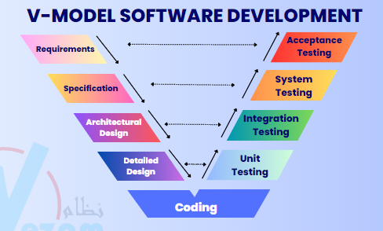
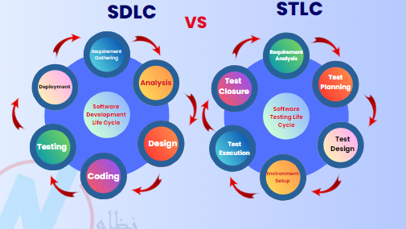

## Manual Software Testing Interview Questions

### 1. What the difference between SDLC & STLC?

```
Software Development Life Cycle (SDLC) is a process used by the software industry to design, develop, and test high quality softwares. The SDLC aims to produce a high-quality software that meets or exceeds customer expectations, reaches completion within times and cost estimates.

Software Testing Life Cycle (STLC) is a sequence of different activities performed by the testing team to ensure the quality of teh software or the product. STLC is an integral part of Software Development Life Cycle (SDLC). But, STLC deals only with the testing phases.
```




### 2. What are the different levels of software testing?

```
- Unit Testing: aims to verify each part of the software by isolating it then perform tests to demonstrate that each individual component is correct in terms of fulfillinf requirements and the desire funcionality [Done by developers]

- Integration Testing: aims to test different parts of the system in combination in order to assess if they work correctly together. By testing the units in groups, any faults in the way they interact together can be identified [Done by developers]

- System Testing: all the components of the software are tested as a whole in order to ensure that the overall product meets the requirements specified [Done by testers]

- Acceptance Testing: is the level software testing process where a product is given the green light or not. The aim of this type of testing is to evaluate whether the system somplies with the end-user requirements and if it is ready for deployment [Done by users]
```

### 3. Explain the steps that the defect goes through from discovery to resolution.


### 4. What is the difference between a test case and a test scenario?

```

- Test scenario is defined as any functionality that can be tested. It is also calles Test Condition or Test Possibility.
  Example: Test the login functionality.

- Test case is a set of actions executed to verify a particular feature or functionality of your software application. A test case contains test steps, test data, precondition, postcondition developed for specific test scenario to verify any requirement.
  Example: Test login with a valid username and a valid password.

- The test scenario can be tested with more than one test case.

```

### 5. What is the difference between functional and non-functional testing?

- Functional testing: is a type of testing which verifies that each function of the software application operates in conformance with the requirement specification. It tests what the system does

- Non-functional testing: is a type of testing to check non-functional aspects (performance, usability, reliability, etc.) of a software application. It tests how well the system performs.

Example:

- In functional testing, we test the login functionality, does it work like expected or not?
- In non-functional testing, we may test the performance of the system when 1000 users login at the same time.

```

### 6. What is the difference between verification and validation?

| Verification                                                                                                                   | Validation                                                                                           |
| ------------------------------------------------------------------------------------------------------------------------------ | ---------------------------------------------------------------------------------------------------- |
| Are we building the produc right?                                                                                              | Are we building the right product?                                                                   |
| Verify the intermediary products like requirement documents, design documents, ER diagrams, test plan, and traceability matrix | Validate the final end product likek developed software or service or system                         |
| Developer point of view                                                                                                        | Customer point of view                                                                               |
| Verified without executing the software code                                                                                   | Validated by executing the software code                                                             |
| Technique used: Informal review, inspection, walkthrough, technical and peer review                                            | Technique used: Functional testing, system testing, regression testingm smoke testing, and many more |

### 7.
```
