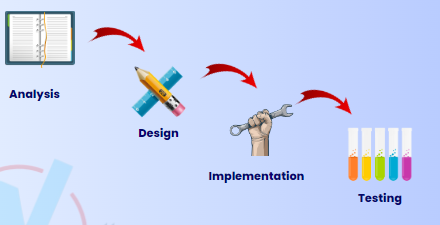
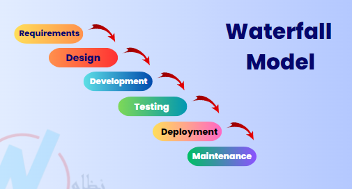
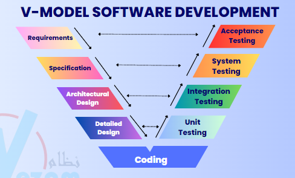
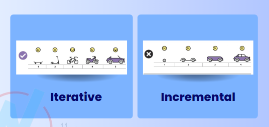
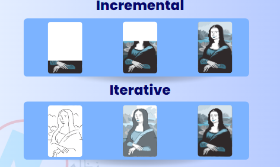
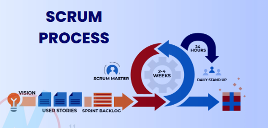
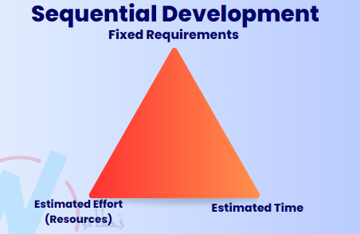
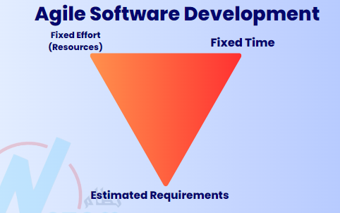
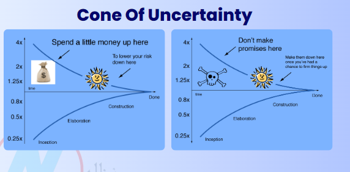

# [The Complete 2025 Software Testing Bootcamp](https://www.udemy.com/course/testerbootcamp/)

## Roles in the Software Development Team

- **Requirements engineers** :
  - The person who collects the requirements from the client and documents them.
  - Mostly a product owner or business analyst.
  - The link between the client and the IT team.
  - Business Analyst mostly responsible of writing more than one document, one of them is Software Requirements Specification (SRS).
  - Product owner is mostly part of Agile team.
  - Product owner writes product backlog, user story (a short of decription of a feature from the end-user perspective) to satisfy customer requirements.
- **UI/UX**:
  - **UI**: Create the visual design of the application (wireframes, mockups, etc.).
  - **UX**: Focus on the user experience, ensuring the application is user-friendly and meets user needs.
- **Front-End, Back-End, and Mobile developers**:
  - **Front-end developers**: Work on the client side of the application, creating the user interface and user experience.
  - **Back-End developers**: Work on the server side, handling the logic, database interactions, and server configuration.
  - **Mobile developers**: Specialize in creating applications for mobile devices, either native or cross-platform.
- **Project Manager & Scrum Master**:
  - **Project Manager**: Manage the project, ensuring it stays on track, within budget, and meets deadlines.
  - **Scrum Master**: Facilitate the Scrum process in Agile teams, ensuring that the team follows Agile principles and practices.
- **Other roles**:
  - **Data scientist**
  - **Database administrator**
  - **AI Specialist**
  - **DevOps Engineer**
  - **Ethical Hacker**
  - **Cloud Engineer**

## How Software is Developed (Software Development Lifecycle (SDLC) Models)

### 1. Sequential Development

- It's called sequential because each phase must be completed before the next one begins.
- Analysis -> Product owner
- Design -> UI/UX
- Implementation -> Developers
- Testing -> Testers

Example of sequential development:

- **Waterfall Model**:
  
  - A traditional SDLC model.
  - A linear and sequential approach to software development.
  - Each phase must be completed before moving to the next.
  - Advantages:
    - Simple and easy to understand.
    - Well-structured and disciplined.
  - Disadvantages:
    - Inflexible to changes.
    - Difficult to accommodate changes once a phase is completed.
    - Not suitable for projects with evolving requirements.
- **V-Model**:
  

  - Create to overcome the limitations of the Waterfall model.
  - Each development phase is associate with a corresponding testing phase.
  - **Requirements**: what the system should do (BRD) | **Acceptance Testing**
  - **Specification**: how the system going to developed (SRS) | **System Testing**
  - **Architectural Design**: how the system going to be designed, interaction between the system component (HLD) | **Integration Testing**
  - **Detailed Design**: detailed design of each component (LLD) | **Unit Testing**
  - **Coding**: actual coding of the system

  - Advantages:
    - Early detection of defects.
    - Each phase has a corresponding testing phase.
    - Better suited for projects with well-defined requirements.
  - Diadvantages:
    - Still inflexible to changes.
    - Not suitable for projects with evolving requirements.
    - Requires extensive documentation.

### 2. Agile Development

- Customer does not give feedback at the end of the project, but during the development process.

Example of Agile development:

- **Iterative**:

  - Focuses on repeating and refining the system or feature.
  - Start with a basic version and improve it over time.
  - Adding more features with each iteration.
  - Analogy: like drawing a potrait, where you start with a rough sketch and refine it with each iteration.
  - Example:
    - Iteration 1: Build a simple login page.
    - Iteration 2: Add input validation.
    - Iteration 3: Add "Remember Me" functionality.
    - Iteration 4: Add Google Login.

- **Incremental**:
  - Focuses on building and delivering features piece by piece.
  - Build the product in small, complete chunks (increments).
  - Each increment adds new functionality to the existing system.
  - The product becomes more complete with each increment.
  - Analogy: like building a house, where you start with the foundation and add rooms one by one.
  - Example:
    - Increment 1: Build the login feature.
    - Increment 2: Add the registration feature.
    - Increment 3: Add the profile management feature.
    - Increment 4: Add the dashboard feature.

### Scrum Process

- **Scrum**: A framework for Agile development.
- **User stories**: A short description of a feature from the end-user perspective, written by the product owner.
- **Product backlog**: A priotitized list of features, enhancements, and bug fixes.
- **Sprint backlog**: A list of tasks to be completed in a sprint, derived from the product backlog.
- **Sprint**: A time-boxed period (usually 2-4 weeks) during which a set of tasks is completed.
- **Daily standup**: A short meeting (15 minutes) where team members share what they did yesterday, what tehy will do today, and any blockers they are facing.
- **Sprint review**: A meeting at the end of the sprint to demonstrate the completed work and gather feedback.

### Diference between Agile and Sequential Development

- Agile is more flexible and adaptable to changes, while sequential development is more rigid and structured.
- Sequential: Fixed requirements - Estiated time - Estimate resources
- Agile: Fixed time - Fixed resources - Estimated requirements

- Cone of Uncertainty:
  - A concept that illustrates how uncertainty decreases as a project progresses.
  - At the beginning of a project, there is a high level of uncertainty about requirements, design, and implementation.
  - As the project progresses, more information is gathered, and uncertainty decreases.

## Basic Concepts of Software Testing

### What is Testing?

- **Software testing** is a way to:
  - asses the quality of the software.
  - reduce the risk of software failure in operation.
- The process of evaluating a system or its components to determine whether they satisfy specified requirements and to identify any defects.
- Most people have had an experience with software that didnt work as expected.
- Software that does not work correctly can lead to many problems, including:
  - Loss of money, time, or business reputation.
  - Injury or death
- Software testing is not only Test execution.
- Software testing is a process which includes many different activites.
- Execution is only one of these activites.

### Main types of Testing

1. Dynamic Testing
   - Dynamic testing requires type of processing the software.
   - The code must be run to perform dynamic testing.
   - Compare the actual results with the expected results.
2. Static Testing
   - Static testing does not require running the code.
   - It is done by reviewing the design, code, and documentation.
   - It is done to find defects before the code is executed.

### Validation vs Verification

**Validation**

- Ensures the software meets the needs and expectations of the end-users.
- Focuses on whether the right product is being built.
- Answers the question: "Are we building the right product?"

**Verification**

- Ensures the software meets the specified requirements and standards.
- Focuses on whether the product is built correctly.
- Answers the question: "Are we building the product right?"

| Validation                     | Verification             |
| ------------------------------ | ------------------------ |
| Does it fit?                   | 2 sleeves?               |
| Is it comfortable to drive in? | Is it size L?            |
| Does the colour match my eyes? | Is it blue?              |
| Can I afford it?               | Are any buttons missing? |
| Is it good quality?            | Is it made of cotton?    |
| Will my date like it?          | Is it made in Italy?     |

### Objectives of Testing

1. Work-product evaluation
2. Requirements fulfillment
3. Building confidence
4. Finding defects
5. Preventing defects
6. Providing information to stakeholders
7. Reduce risk
8. Compliance with Laws and regulations
9. Objective may vary

### Testing & Debugging

- **Testing**: The process of executing a program with the intent of finding errors.
- **Debugging**: The process of finding and removing the causes of software defects.
- Testing is done to find defects, while debugging is done to fix them.
- **Confirmation Testing**: Also known as re-testing, it is done to confirm that the defect has been fixed.

### Test Process

- Steps that software testers follow to ensure the quality of the software.

1. **Test Planning**
   - Who is testing team and what are their roles?
   - What are the testing objectives?
   - What are appropriate testing techniques?
   - The tools and standards to be used?
2. **Test Monitoring & Control**
   - Compare actual progress against the plan after 2 weeks.
3. **Test Analysis**
   - Analyze the requirements
   - Identify the testable requirements.
   - What to test?
   - What is the test condition?
4. **Test Design**
   - Design the test cases.
   - Create the test scripts.
   - Prepare the test environment.
   - What is the expected result?
   - What is the test data?
   - How to test the functionality?
5. **Test Implementation**
   - Prepare the test environment.
   - Prepare the test data.
   - Prepare the test scripts.
   - Prepare the test cases.
   - Prepare the test environment.
6. **Test Execution**
   - Run the test cases.
   - Log the defects.
   - Report the defects.
7. **Test Completion**
   - Evaluate cycle completion
   - Evaluate exit criteria.

### Test Levels

- Test levels are groups of test activites that are organized and managed together.
- Each test level is an instance of the test process.
- Test levels are related to other activites within the software development lifecycle.

> **Unit -> Integration -> System -> Acceptance**

1. **Unit Testing** -> developers, tester (automation)
   - Unit testing/component testing focuses on components that are separately testable.
2. **Integration Testing**
   - Integration testing focuses on the interaction between components.
   - Divide to 2:
     - Component integration: testing the interaction between components -> developers
     - System integration: testing the interaction between systems -> testers
3. **System Testing**
   - System testing often produces information that issued by stakeholders to make release decisions.
   - The test environment should ideally correspond to the final target or production environment.
   - System testing should focus on the overall, end-to-end behavior of the system as a whole
   - Independent testers typically carry out system testing.
4. **Acceptance Testing**
   - Acceptance testing, like system testing, typically focuses on the behavior and capabilities of a whole system or product.
   - Alpha testing:
     - Invite a small group of users to test the system in a controlled environment.
   - Beta testing:
     - Release the system to a larger group of users for testing in a real-world environment.

### Testing Types

1. **Functional Testing**
   - Testing what the system does (its functionality).
   - Usually answered with (Yes/No).
2. **Non-functional Testing**
   - Testing how the system performs (its performance, usability, etc.).
   - Hard to anser with (Yes/No).
   - Usually measured as a range.
   - Examples:
     - Performance testing
     - Usability testing
     - Load testing
3. **Black-Box Testing**
   - Testing without knowing the internal structure of the system.
   - Very near to the requires of the user.
   - Focuses on inputs and outputs.
4. **White-Box Testing**
   - Testing while monitoring the internal structure of the system.
5. **Dynamic Testing**
   - Testing by executing the code.
   - Requires the code to be run.
6. **Static Testing**
   - Testing without executing the code.
   - Done by reviewing the design, code, and documentation.
7. **Retesting/Confirmation Testing**
   - Testing after debugging to ensure defects are fixed.
8. **Regression Testing**
   - Testing unchanged areas to ensure they are not affected by changes.
9. **Smoke Testing**
   - Testing the basic functionality of the system to ensure it is stable enough for further testing.

## Test Scenarios Writing

### What is a Test Scenarion?

- A **test scenario** is defined as any functionality that can be tested.
- It is also called Test Condition or Test Possibility.
- As a tester, you should put yourself in the end-user's shoes and figure out the real-world scenarios and use cases of the Application Under Test (AUT).
- A test scenario is a high-level description of what to test, not how to test it.

### How to create a Test Scenario?

1. Carefully study the Requirement Document - Business Requirement Specification (BRS), Software Requirement Specification (SRS), Functional Requirement Specification (FRS) pertaining to the System Under Test (SUT).
2. Isolate every requirement, and identify what possible user actions need to be tested for it. Figure out the technical issue associated with the requirement. Also remember to analyze and frame possible system abuse scenarios by evaluating the software with a hacker eyes.
3. Enumerate test scenarios that cover every possible feature of the software. Ensure that these scenarios cover every user flow and business flow involved in the operation of the website or app
4. After listing the test scenarios, create a Traceability Matrix to ensure that every requirement is mapped to a test scenario.
5. Get the scenarios reviewed by a supervisor, and then push them to be reviewd by other stakeholders involved in the project.

- **Valid scenarios**: using the application as intended, testing edge cases, testing error handling.
  - Login with valid credentials
  - Register with valid email and password
  - Search for a product
  - Add a product to the cart
- **Invalid scenarios**: using the application as unintended, testing error handling.
  - Login with invalid credentials
  - Register with invalid email format
  - Search for a non-existent product
  - Add a product to the cart with insufficient stock
